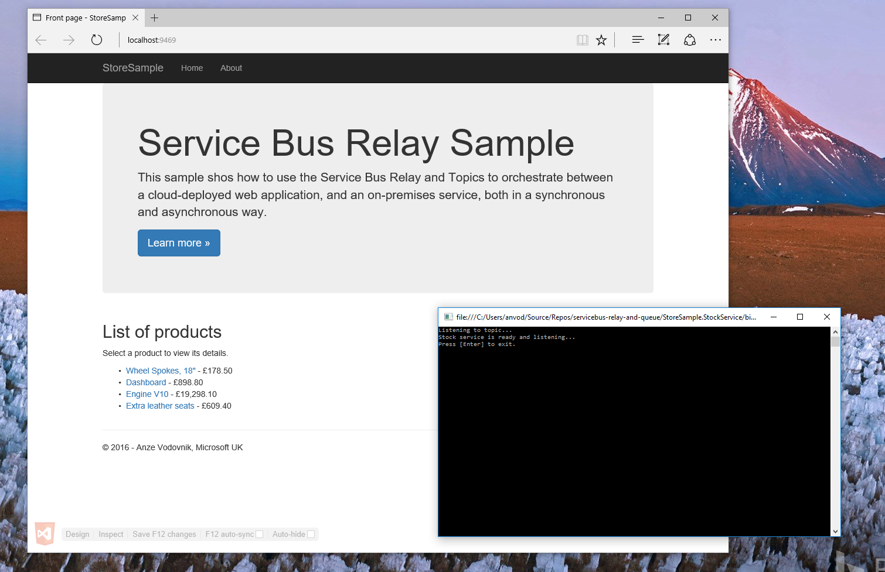
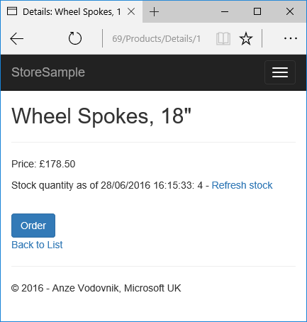
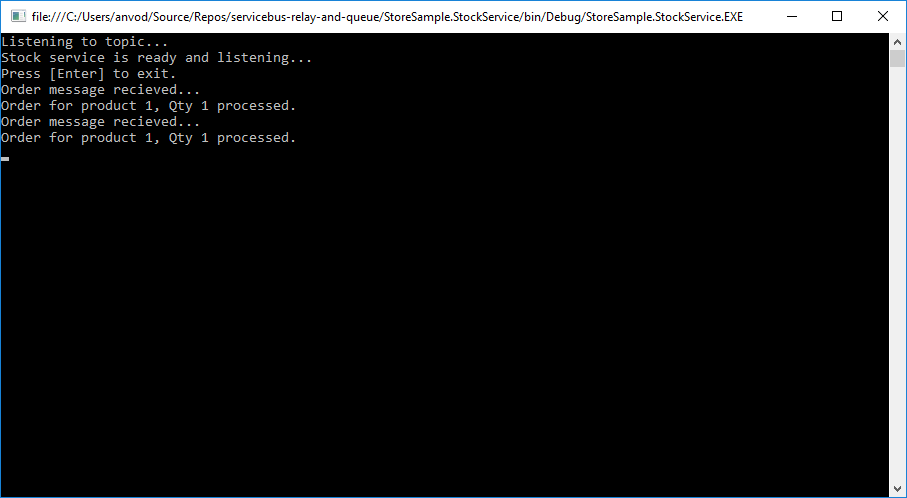

# Service Bus Relay and Queue/Topic sample
This sample shows a simple "e-commerce" application that uses [Service Bus Relay](https://azure.microsoft.com/en-gb/documentation/articles/service-bus-relay-overview/) to communicate to an on-premises service for checking stock of items. In addition, it uses [Service Bus Topics](https://azure.microsoft.com/en-gb/documentation/articles/service-bus-queues-topics-subscriptions/) to place an order. The message (order) is then consumed in the same on-premises service. 


## Getting Started

1. Create a Service Bus Namespace through http://manage.windowsazure.com. Detailed instructions are available [here](https://azure.microsoft.com/en-gb/documentation/articles/service-bus-dotnet-how-to-use-relay/).
2. Create or obtain the default management key.
3. Update relevant configuration in app.config and web.config (`appSettings`).
4. Run the Sample. Both `StoreSample.StockService` and `StoreSample.Web` will start.

## StoreSample



The application consists of two parts: the web application, representing a simple online _store_, and the corresponding console application, representing an on-premises deployed _inventory_ system.

Each time the application is run, if nothing is cached, a call is made through Service Bus Relay to get the entire list of products. 

You can navigate to the details of a product, which includes a rough *estimate* of the stock quantity (cached). The user can then choose to refresh the stock, which triggers an update call to be made through the relay service. 



Alternatively, the user can proceed to submit an order, which enqueues a message into a Topic that is created automatically as the console application starts up. The order is picked up by the running console app, and stock is decreased. You will note that the number does not automatically refresh on the web app - this operation needs to be triggered by the user.

Each order that comes into the topic will show up in the console.



Because the product list is cached, you can close the console application while it's running, and try to submit multiple orders. 

If you then restart the console app, you'll notice it will pick up the orders immediately.

## Why topics?

Topics are used in this sample because they are useful in similar scenarios, where you potentially have multiple subscribers listening to a single message. For example, you could have the StockService and an InvoicingService listening to the same "Order" message. When the message is received, the invoice is generated, stored and prepared for sending, while the StockService processes the order.  

## Solution Structure

There are three projects in the solution. 

### StoreSample.Models

This project contains the relevant contracts and models that are used by both the web application and the on-premises console application. 

The key thing to note in this part is the declaration above the interfaces:

```cs

    [ServiceContract(Namespace="urn:ps")]
    public interface IStockService { ... }

```
This is required for Service Bus to understand what it needs to "expose" when spinning up a service host.

### StoreSample.StockService

The on-premises console application is comprised of a dummy _repository_ called `StockRepositoryDummy` which acts as the storage for our inventory collection. Additionally, this is where `StockService`, the implementation of the `IStockService` interface, resides. The meat of the project, though, is hosted in `Program.cs`. This is where the service host is spun up, and the Subscription client is created. 

### StoreSample.Web

The web part is a simple ASP.NET MVC application that follows a standard Model-View-Controller pattern. The initial `Index` action  that is hit is defined in the `HomeController`. All it does is "call through" to a _gateway_ that serves as an abstraction towards the entire relay part of the solution. Inside that gateway you can see how the relay client is instantiated, as well as how the _cache-through_ pattern is used. 


## More information

Patterns used:

- [Cache Aside](https://msdn.microsoft.com/en-gb/library/dn589799.aspx)
- [Service Gateway](https://msdn.microsoft.com/en-us/library/ff650101.aspx)
- [Repository](https://msdn.microsoft.com/en-us/library/ff649690.aspx)
